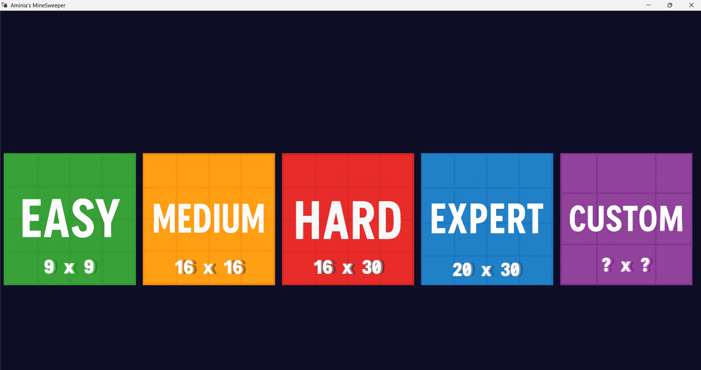
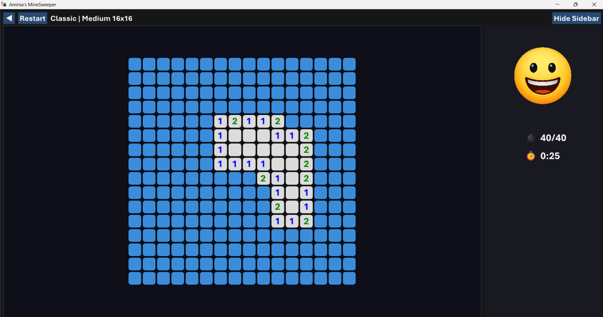
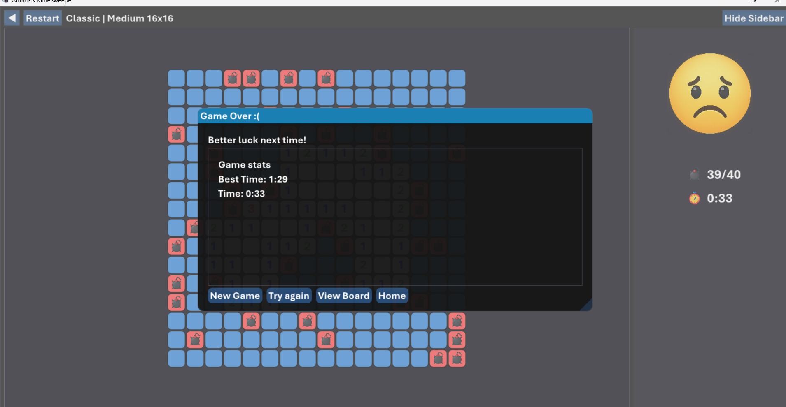

# Minesweeper-imgui

## What you need

1. Visual Studio 2022
1. Directx 11

Anything else is included in the project

## Used libraries

1. ImGui (main)
1. miniaudio
1. stb image

## Release Note

A functional minesweeper game based on imgui and DX11

## Screenshots

